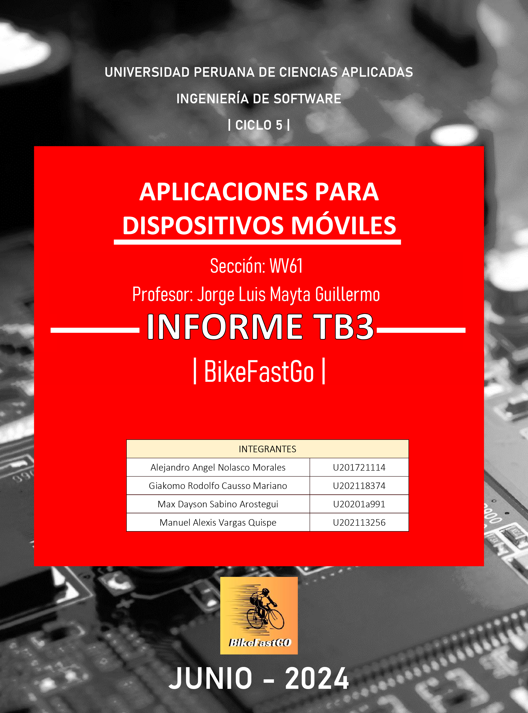
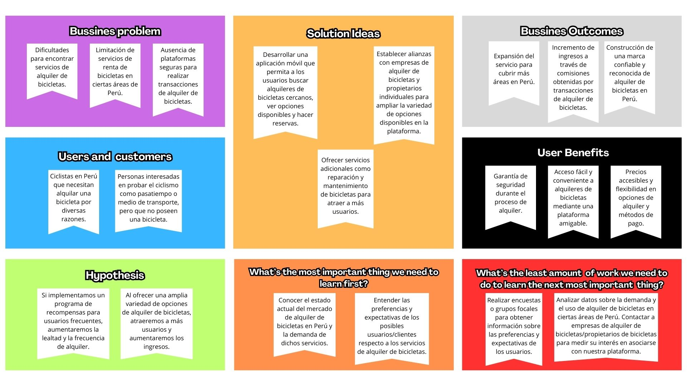
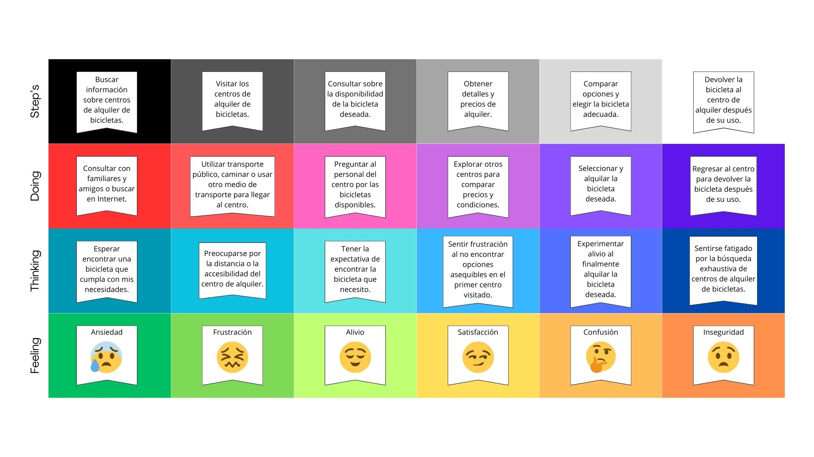
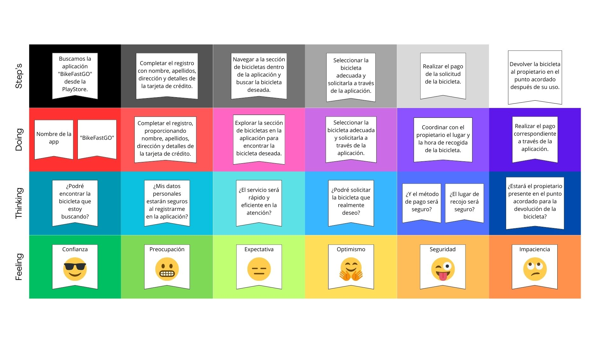
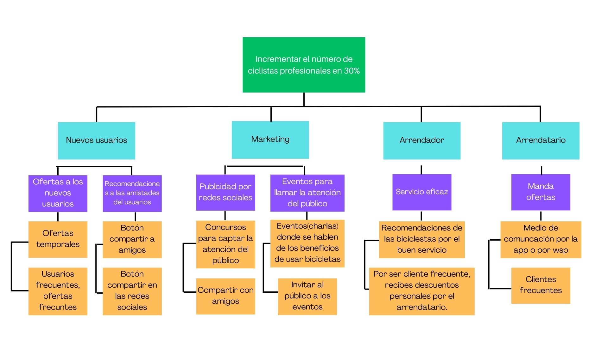

# CONTENT
##  CONTROL DE VERSIONES
##  STUDENT OUTCOME
# CAPÍTULO I: PRESENTACION
## 1.1. Startup Profile
### 1.1.1. Descripción de la Startup 
### 1.1.2. Perfiles de integrantes del equipo 
## 1.2. Solution Profile
### 1.2.1. Antecedentes y problemática 
### 1.2.2. Lean UX Process
#### 1.2.2.1. Lean UX Problem Statements
#### 1.2.2.2. Lean UX Assumptions 
#### 1.2.2.3. Lean UX Hypothesis Statements
#### 1.2.2.4. Lean UX Canvas
## 1.3. Segmentos objetivo

# CAPÍTULO II: NEEDFINDING 
## 2.1. Competidores
### 2.1.1. Análisis Competitivo 
### 2.1.2. Estrategias Y Tácticas Frente A Competidores 
## 2.2. Entrevistas
### 2.2.1. Diseño De Entrevistas
### 2.2.2. Registro De Entrevistas
### 2.2.3. Análisis De Entrevistas
## 2.3. Needfinding
### 2.3.1. User Personas 
### 2.3.2. User Task Matrix 
### 2.3.3. User Journey Mapping
### 2.3.4. Empathy Mapping
### 2.3.5. As-Is Scenario Mapping
### 2.3.6. To-Be Scenario Mapping
### 2.3.7. User Stories
### 2.3.8. Impact Mappin
### 2.3.9. Product Backlog

# CAPÍTULO III: ARQUITECTURA
## 3.1. Class Diagram
## 3.2. Relational/Non-relational Database Diagram
## 3.3. User Flow Diagram
## 3.4. Android Mobile App Wireframes with interaction 

# CAPÍTULO IV: BACKEND PRODUCT IMPLEMENTATION & VALIDATION 
## 4.x. Sprint backlog x
## 4.x.1. Software Development Configuration
## 4.x.2. Deployed Web Services RESTful API with Documentation
## 4.x.3. Device-tested Android Mobile Application(s)

# CAPÍTULO V: PRODUCT IMPLEMENTATION, VALIDATION & DEPLOYMENT
## 5.1. Deployed Startup Product Responsive Landing Page Web App
## 5.2. Validation Interviews
#### 5.2.1. Diseño de Entrevistas
#### 5.2.2. Registro de Entrevistas
## 5.3. Video About-the-Product
## 5.4. Video About-the-Product

# CONCLUSIONES
# BIBLIOGRAFÍA 
# ANEXOS 
-------------------------------

# CONTROL DE VERSIONES
| Versión | Fecha | Autor | Descripción de modificación |
|-----------|-----------|-----------|-----------|
| TB1  | 25/03/2024  | Grupo 2  | - Temas de los capítulos: I y II|
| TB2  | 15/04/2024  | Grupo 2  | - Temas de los capítulos: III y IV|
| TP  | 30/04/2024  | Grupo 2  | - Temas de los capítulos: V|
| TB3  | 01/06/2024  | Grupo 2  | - Sprint 2 |
| TB4  | 18/06/2024  | Grupo 2  | - Sprint 3 |

# METODOLOGÍA SMART

# STUDENT OUTCOME
| Criterio específico | Acciones realizadas | Conclusiones |
|-----------|-----------|-----------|
| Actualiza conceptos y conocimientos necesarios para su desarrollo profesional y en especial para su proyecto en soluciones de software.| **- Giakomo Causso Rodolfo Mariano:**   **TB1/TB2/TP1/TB3:** Hice mejoras y actualizaciones del Sprint 1 al Sprint 2 , observando y analizando en que hemos fallado , tambien añadimos otras funciones mas para un mejor funcionamiento completo de nuestro aplicacion   **- Manuel Alexis Vargas Quispe:**   **TB1/TB2/TP/TB3:** Se implementó el lean UX Canvas, así como ayudar en parte del Cap2 - Realizó de manera satisfactoria los flow diagrams y user stories/product backlog - También se realizó una primer avance del front de nuestro trabajo y también el completar toda la documentación.   **- Max Sabino Arostegui:**   **TB1:** Se realizó el estudio comparativo con respecto a nuestros competidores, se planteo estrategias y tacticas. Asimismo, se realizó el analisis de las entrevistas.   **- Alejandro Angel Nolasco Morales:**   **TB1/TB2/TP:** Se realizaron las "hypothesis" en base a las necesidades y problemáticas del proyecto, se realizaron wireframes, mockup, lógica y landing page.   **- Max Sabino Arostegui:**   **TB2:** Se realizaró el"sprint backlog 1", para ello se investigo acerca de los nuevos conceptos de seguridad y confiabilidad.|Los objetivos establecidos se alcanzaron mediante una comunicación constante y una organización eficaz por parte de nuestro equipo, lo que facilitó la elaboración y la implementación exitosa de la primera entregrea del proyecto.|
| Reconoce la necesidad del aprendizaje permanente para el desempeño profesional y el desarrollo de proyectos en soluciones de software.  | **- Giakomo Causso Rodolfo Mariano:**   **TB1/TB2/TP1:** Elaboracion del Sprint 2 reforzando, mejorando y añadiendo los puntos anteriores para que la aplicacion sea completo   **- Max Sabino Arostegui:**   **TB1:** Se investigó a los competidore y evaluo el FODA de cada uno, asimismo se diseño las preguntas para realizar las entrevistas a nuestros dos segmentos objetivos.     **- Manuel Alexis Vargas Quispe:**   **TB1/TB2/TP/TB3:** Elaboracion del Sprint 2 reforzando, mejorando y añadiendo los puntos anteriores para que la aplicacion sea completo junto a las mejoras del doc.  **- Alejandro Angel Nolasco Morales:**   **TB1/TB2/TP:** Se realizó el acercamiento visual con interacción, siguiendo las HU y goals para fidelidad de BikeFastGo, se utilizaron herramientas de elaboración de wireframes, landing page con css js y html.    **- Max Sabino Arostegui:**   **TB2:** Se realizaró el"class diagram" para el desarrollo de nuestro proyecto teniendo en cuenta las necesidades identificadas, esto nos ayuda a contribuir con nuestro aprendizaje. | Se alcanzó con éxito el objetivo de elaborar y retroalimentar tanto el informe técnico como el funcional. Además, se llevó a cabo de manera correcta y exitosa los puntos del Capitulo I y II |

# CAPÍTULO I: PRESENTACION
## 1.1. Startup Profile

### 1.1.1. Descripción de la Startup 
"BikeFastGO es una plataforma innovadora que te ofrece la libertad de moverte por la ciudad de manera rápida y eficiente, sin la necesidad de poseer una bicicleta propia. Nuestra aplicación te permite encontrar y alquilar bicicletas disponibles en tu área en cuestión de minutos, con una amplia selección de modelos y estilos para adaptarse a tus necesidades específicas.

Con BikeFastGO, nunca más te encontrarás atrapado sin una bicicleta cuando la necesites. Ya sea que estés buscando una opción para transportarte de un lugar a otro, o simplemente quieras disfrutar de un paseo relajante por la ciudad, nuestra plataforma te conecta con bicicletas de calidad en cualquier momento y lugar.

Nuestra interfaz intuitiva te permite navegar fácilmente por las opciones disponibles, ver las tarifas de alquiler y reservar la bicicleta perfecta con solo unos pocos clics. Además, hemos establecido un proceso seguro y confiable para la entrega y devolución de las bicicletas, asegurándote una experiencia sin complicaciones en cada viaje.

**Misión**

Nuestra misión principal es promover un estilo de vida activo y sostenible al proporcionar un acceso conveniente y asequible a bicicletas de calidad. Nos comprometemos a mejorar la movilidad urbana, fomentar hábitos saludables y contribuir a la reducción de la congestión vehicular y la huella de carbono en nuestras ciudades.

**Visión**

Nosotros aspiramos ser la plataforma líder a nivel nacional en alquiler de bicicletas gracias a nuestra app con su facil y rapido funcionamiento de ello, ofreciendo tambien a las personas una forma accesible , segura y sostenible de moverse por las ciudades. Nos esforzamos por ser reconocidos como agentes de cambio positivo en la movilidad urbana, inspirando a las personas a adoptar un estilo de vida más activo y respetuoso con el medio ambiente."

**Valores**

-  **Sostenibilidad:** Nos comprometemos a promover prácticas sostenibles en todas nuestras operaciones y a contribuir a la protección del medio ambiente.
-   **Accesibilidad:** Creemos en proporcionar un acceso equitativo a la movilidad urbana, asegurando que nuestras bicicletas estén disponibles y accesibles para todos.
-  **Calidad:** Nos esforzamos por ofrecer bicicletas de alta calidad y un servicio excepcional a nuestros usuarios en todo momento.
-   **Innovación:** Buscamos constantemente nuevas formas de mejorar y optimizar nuestra plataforma para satisfacer las necesidades cambiantes de nuestros usuarios y del entorno urbano.
-  **Comunidad:** Valoramos la creación de una comunidad inclusiva y colaborativa de usuarios, proveedores y socios que comparten nuestra pasión por la movilidad sostenible y el ciclismo urbano.
### 1.1.2. Perfiles de integrantes del equipo 

|Nombre| Código de Alumno/Carrera| Descripción del Alumno | Foto tamaño carnet |
|---------------|------------------|------------------------|--------------------|
|Giakomo Rodolfo Causso Mariano|u202118374/Ingeniería de Software|En el progreso que obtuve respecto a mis conocimientos académicos, pude aprender lenguajes como **Java**, **JavaScript**, **C++**, **C#**, **SQL**, **HTML y CSS**. Dentro del desarrollo de la carrera de Ingenieria de software pude tener un mayor concepto referente a proyectos y gracias a eso es sido capaz de desarrollar habilidades como el **liderazgo**, **compañerismo**, **compromismo**, **responsabilidad** y **creatividad**| |

|Nombre| Código de Alumno/Carrera | Descripción del Alumno | Foto tamaño carnet |
|---------------|------------------|------------------------|--------------------|
|Manuel Alexis Vargas Quispe|u202113256/Ingeniería de Software|Una de las principales fortalezas que poseo es mi firme compromiso con el trabajo en equipo, acompañado de mi habilidad innata para mostrar compromiso hacia todos los integrantes de un grupo. Estas competencias me habilitan para desempeñarme eficazmente en contextos colaborativos y mantener relaciones constructivas y positivas con mis colegas, lo que contribuye al éxito conjunto de nuestros proyectos.|  

|Nombre| Código de Alumno/Carrera | Descripción del Alumno | Foto tamaño carnet |
|---------------|------------------|------------------------|--------------------|
|Max Dayson Sabino Arostegui|u20201a991/Ingeniería de Software|He desarrollado habilidades blandas como la comunicación asertiva, trabajo en equipo, resiliencia y empatia. Mis conocimientos academicos son en lenguajes como C++, Python, TypeScript. Asimismo, conocimientos en HTML, CSS y SQL|

|Nombre| Código de Alumno/Carrera | Descripción del Alumno | Foto tamaño carnet |
|---------------|------------------|------------------------|--------------------|
|Alejandro Nolasco Morales|u201721114 / Ingeniería de software|Interesado por la nuevas tecnologías, arquitecturas emergente y todo lo relacionado al ámbito del softwware, se adecua a los sprint en los proyectos y resiliente.|

  

## 1.2. Solution Profile
### 1.2.1. Antecedentes y problemática 

- **¿Qué es el problema? (What - Qué):**

En el contexto actual, se presenta una problemática crítica relacionada con la falta de acceso a bicicletas en buen estado, el coste de ello y la dificultad que enfrentan las personas para encontrar opciones de transporte sostenible y eficiente.

- **¿Cuándo sucede el problema? (When - Cuándo):**

Este problema es especialmente relevante en la actualidad, donde la conciencia sobre la importancia de la movilidad sostenible está en aumento, pero aún existen limitaciones en la disponibilidad de bicicletas para satisfacer la demanda.

- **¿Dónde sucede el problema? (Where - Dónde):**

El problema se presenta en entornos urbanos y rurales de diversas partes del Perú, donde las personas buscan alternativas de transporte económicas y de calidad, pero encuentran dificultades para acceder a bicicletas cuando las necesitan.

- **¿A quién se le presenta el problema? ¿Cuál es tu público objetivo? (Who - Quién):**

Nuestro público objetivo se compone de personas de 18 y 35 años de edad, que buscan opciones de transporte sostenible y económico para sus desplazamientos diarios. Como por ejemplo trabajadores o estudiantes universitarios que necesiten un trasporte mas eficiente para su desplazamiento diario, para las personas que usan la bicicleta como deporte o para persona que buscan probar o comprar bicicletas de diferentes tipos, modelos y calidades

- **¿Por qué sucede el problema? ¿Qué situación ocasiona el problema? (Why - Por qué):**

Esta problemática surge debido a la falta de infraestructura adecuada para el alquiler de bicicletas, así como a las limitaciones en la disponibilidad y diversidad de opciones de bicicletas para satisfacer las necesidades de los usuarios.

- **¿Cómo sucede el problema? ¿Cuáles son las precondiciones para que se presente el problema? (How - Cómo):**

El problema se agrava debido a la falta de sistemas eficientes de alquiler de bicicletas, la escasez de puntos de recogida y devolución convenientes, y la falta de conciencia sobre los beneficios de la movilidad en bicicleta.

- **¿Cuánto impacto económico genera este problema? (How much - Cuánto):**

El impacto económico de este problema es significativo, ya que la falta de acceso a opciones de transporte sostenible puede resultar en mayores costos de transporte para los usuarios y contribuir a la congestión vehicular y la contaminación ambiental, lo que a su vez tiene repercusiones económicas negativas.

Esta descripción resalta de manera efectiva los antecedentes y la problemática que BikeFastGO aborda en el mercado peruano.

### 1.2.2. Lean UX Process
#### 1.2.2.1. Lean UX Problem Statements
Nuestro enfoque se centra en abordar las dificultades que enfrentan los usuarios al intentar acceder a una bicicleta para diversas actividades, ya sea para explorar nuevos lugares lejanos a su residencia o para disfrutar de una experiencia deportiva. Nos damos cuenta de que encontrar una empresa de alquiler de bicicletas cercana a su ubicación actual puede ser complicado y a menudo limitante.

Nuestro objetivo es proporcionar una solución que permita a los usuarios alquilar bicicletas de manera fácil y conveniente en cualquier lugar del Perú, en cualquier momento del día y cualquier día de la semana. Nos esforzamos por ofrecer un servicio rápido y seguro, conectando directamente a los usuarios con propietarios de bicicletas disponibles para alquiler. Buscamos garantizar que cada transacción se realice de manera segura y sin complicaciones.

Nos preguntamos cómo podemos superar los desafíos logísticos y tecnológicos para brindar un servicio de alquiler de bicicletas que sea accesible, rápido y seguro en todo el territorio peruano. Estamos comprometidos a encontrar una solución innovadora que satisfaga las necesidades de movilidad de nuestros usuarios y promueva un estilo de vida activo y sostenible en todas las comunidades.

#### 1.2.2.2. Lean UX Assumptions 
Consideramos que nuestra plataforma será mayormente utilizada por individuos que requieren una bicicleta para actividades deportivas o para desplazarse en áreas distantes de su lugar de residencia.

Creemos que los usuarios estarán interesados en un servicio de alquiler de bicicletas que esté disponible las 24 horas del día, los 7 días de la semana, sin importar su ubicación. 

Consideramos que facilitar una conexión rápida y segura entre aquellos que desean alquilar bicicletas y los proveedores será fundamental para el éxito del servicio. 

Suponemos que la mayoría de los usuarios tendrán acceso a una conexión 4G, ya que el servicio depende de la conectividad a Internet para su funcionamiento.

#### 1.2.2.3. Lean UX Hypothesis Statements

Facilidad de uso: Si simplificamos el proceso de alquiler de bicicletas, reduciendo el número de pasos necesarios para completar una reserva, aumentará la tasa de conversión de usuarios que completan el proceso de alquiler.

Claridad en la información: Si proporcionamos información clara y detallada sobre las ubicaciones de recogida y entrega de bicicletas, así como sobre las tarifas y condiciones de alquiler, los usuarios se sentirán más confiados al realizar una reserva.

Personalización de la experiencia: Si personalizamos las recomendaciones de bicicletas y rutas según las preferencias y necesidades individuales de los usuarios (como nivel de experiencia en ciclismo, tipo de terreno preferido, duración del viaje, etc.), aumentará la satisfacción del usuario y la fidelidad a la plataforma.

Accesibilidad: Si diseñamos la interfaz de usuario y la experiencia de navegación teniendo en cuenta la accesibilidad para usuarios con discapacidades visuales o motoras, aumentará la inclusión y la base de usuarios potenciales.

Retroalimentación instantánea: Si implementamos un sistema de retroalimentación instantánea que permita a los usuarios evaluar la calidad de las bicicletas, las estaciones de recogida/devolución y el servicio al cliente, podremos identificar y abordar rápidamente cualquier problema, mejorando así la satisfacción del usuario.

Confianza y seguridad: Si garantizamos medidas de seguridad adecuadas, como la revisión regular de las bicicletas, la disponibilidad de cascos y candados, y la transparencia en los términos de seguro, aumentará la confianza de los usuarios en el servicio y la probabilidad de que realicen reservas.

Comunidad y participación: Si fomentamos la creación de una comunidad de usuarios a través de funciones sociales, como la posibilidad de compartir rutas favoritas, consejos de ciclismo y experiencias en las redes sociales integradas en la plataforma, aumentará el compromiso y la retención de usuarios.

#### 1.2.2.4. Lean UX Canvas

## 1.3. Segmentos objetivo
Nuestro servicio esta dirigido a los siguientes grupos: 

- Personas entre 18 y 35 años (Arrendatario):

Este grupo demográfico representa a una parte significativa de la población activa y dinámica que busca opciones de transporte convenientes y económicas para sus desplazamientos diarios. Estos individuos pueden ser estudiantes universitarios, jóvenes profesionales o trabajadores que buscan alternativas de movilidad sostenible y rentable. Buscan opciones flexibles que les permitan moverse fácilmente por la ciudad, ya sea para ir al trabajo, a la universidad, para actividades recreativas o deportivas. BikeFastGO ofrece una solución ideal para este segmento al proporcionar acceso rápido y conveniente a bicicletas de calidad en cualquier momento y lugar.

- Personas que desean generar ingresos adicionales mediante la renta de su bicicleta (Arrendador):

Este segmento está compuesto por propietarios de bicicletas que desean aprovechar su activo para generar ingresos adicionales. Pueden ser ciclistas aficionados, entusiastas del ciclismo o simplemente personas que poseen bicicletas que no utilizan con frecuencia. Estas personas buscan una plataforma confiable y segura donde puedan alquilar sus bicicletas a otros usuarios interesados, ganando dinero extra mientras ayudan a promover un estilo de vida activo y sostenible. BikeFastGO ofrece una oportunidad para que estos propietarios de bicicletas puedan monetizar sus activos de manera fácil y segura, conectándolos con una base de usuarios interesados en alquilar bicicletas en su área.

# CAPÍTULO II: NEEDFINDING 
## 2.1. Competidores
### 2.1.1. Análisis Competitivo 
-   Social Bycyles <https://socialbicycles.com/>

Una aplicación que ofrece un servicio de alquiler de bicicletas
compartidas. Los usuarios pueden localizar, desbloquear y alquilar
bicicletas disponibles a través de la aplicación móvil. La plataforma
permite a los usuarios encontrar bicicletas cercanas utilizando la
función de geolocalización, reservarlas y desbloquearlas mediante un
código QR. Además, ofrece características sociales que permiten a los
usuarios compartir rutas, ver estadísticas de viaje y conectarse con
otros ciclistas. La aplicación también incluye opciones para planificar
rutas, obtener información sobre estaciones de bicicletas y administrar
la cuenta del usuario.

-   Donkey Republic <https://www.donkey.bike/>

Es una plataforma que ofrece un servicio de alquiler de bicicletas a
través de una aplicación móvil y estaciones físicas ubicadas en diversas
ciudades. Los usuarios pueden localizar y desbloquear bicicletas
disponibles utilizando la aplicación, lo que les permite alquilarlas por
períodos cortos o largos de tiempo. La aplicación proporciona
información sobre la ubicación de las estaciones de bicicletas, permite
realizar reservas con antelación y ofrece opciones de pago integradas.
Además, los usuarios pueden acceder a características como la navegación
GPS, el seguimiento de la distancia recorrida y la gestión de la cuenta
desde la aplicación.

-   City Bike Lima <https://www.citybikelima.com/>

Es un servicio de alquiler de bicicletas compartidas en la ciudad de
Lima, Perú. La plataforma permite a los usuarios alquilar bicicletas a
través de su sitio web o aplicación móvil. Los usuarios pueden encontrar
estaciones de bicicletas cercanas, desbloquear bicicletas utilizando
códigos QR y disfrutar de paseos por la ciudad. Además, City Bike Lima
ofrece opciones de membresía para usuarios frecuentes y turistas, lo que
les permite acceder a tarifas especiales y beneficios adicionales. La
plataforma también promueve un estilo de vida saludable y sostenible al
fomentar el uso de la bicicleta como medio de transporte alternativo en
Lima

<table>
  <tr>
    <th colspan="6" valign="top"><b>Competitive Analysis Landscape</b></th>
  </tr>
  <tr>
    <td colspan="2" rowspan="2" valign="top">¿Por qué llevar a cabo este análisis?</td>
    <td colspan="4" valign="top">¿Quiénes son nuestros principales competidores y qué nos diferencia de ellos?</td>
  </tr>
  <tr>
    <td colspan="4" valign="top">Mediante la evaluación de los competidores que operan en el mercado, obtendremos información sobre sus puntos fuertes y áreas de mejora. También seremos capaces de discernir las tácticas que emplean y su impacto en el mercado. Utilizando los datos obtenidos de este análisis competitivo, podremos desarrollar estrategias que nos ayuden a establecernos de manera efectiva en el mercado.</td>
  </tr>
  <tr>
    <td colspan="2" valign="top"></td>
    <td colspan="1" valign="top"></td>
    <td colspan="1" valign="top"></td>
    <td colspan="1" valign="top"></td>
    <td colspan="1" valign="top"></td>
  </tr>
<tr><td colspan="1" rowspan="2" valign="top">
<b>P</b>

<b>E</b>

<b>R</b>

<b>F</b>

<b>I</b>

<b>L</b>
</td><td colspan="1" valign="top">Overview</td><td colspan="1" valign="top">Una nueva empresa emergente que busca simplificar el acceso al alquiler de bicicletas en todo el país.</td><td colspan="1" valign="top">Una empresa global que ofrece programas de bicicletas compartidas, prácticos y accesibles para los usuarios.</td><td colspan="1" valign="top">Una empresa multinacional que proporciona bicicletas de alquiler disponibles para bloqueo y desbloqueo a través de teléfonos inteligentes.</td><td colspan="1" valign="top">Empresa que ofrece bicicletas en el distrito de Miraflores de la ciudad de Lima -Perú</td></tr>
<tr><td colspan="1" valign="top">
Ventaja  

competitiva 

¿Qué valor  

ofrece a los  

clientes?
</td><td colspan="1" valign="top">Proporcionamos una amplia selección de bicicletas que abarcan diversos tipos, modelos y rangos de precios. Además, ofrecemos una plataforma donde puedes poner tus propias bicicletas en alquiler.</td><td colspan="1" valign="top">Las bicicletas que se ofrecen están habilitadas para su uso con GPS y se pueden alquilar con su smartphone. </td><td colspan="1" valign="top">Alquiler de bicicletas en cualquier momento y disponibles en varias ciudades, con la facilidad de alquilar 5 bicicletas a la vez</td><td colspan="1" valign="top">Servicio público, con 100 estaciones en el distrito </td></tr>
<tr><td colspan="1" rowspan="2" valign="top">
<b>P</b>

<b>E</b>

<b>R</b>

<b>F</b>

<b>I</b>

<b>L</b>

<b>D</b>

<b>E</b>

<b>M</b>

<b>A</b>

<b>R</b>

<b>K</b>

<b>E</b>

<b>T</b>

<b>I</b>

<b>N</b>

<b>G</b>
</td><td colspan="1" valign="top">Mercado objetivo</td><td colspan="1" valign="top">Personas con mayoría de edad hasta los 45 años que sepan manejar una bicicleta o quienes tengan y quieren alquilar. </td><td colspan="1" valign="top">
Ciudadanos entre los 18 y 60 años que necesiten el uso de una bicicleta

</td><td colspan="1" valign="top">Ciudadanos mayores de 20 años</td><td colspan="1" valign="top">Personas de todas las  edad que requieran movilizarse dentro del distrito usualmente</td></tr>
<tr><td colspan="1" valign="top">
Estrategias de  

marketing
</td><td colspan="1" valign="top">
Publicitando mediante redes sociales nuestras características y planes que ofrecemos

</td><td colspan="1" valign="top">Publicidad a través de su app oficial en Google play y App Store</td><td colspan="1" valign="top">Publicidad mediante su pagina web, redes sociales y su aplicativo</td><td colspan="1" valign="top">Publicidad a través de su página web con información y contactos.</td></tr>
<tr><td colspan="1" rowspan="3" valign="top">
<b>P</b>

<b>R</b>

<b>F</b>

<b>I</b>

<b>L</b>

<b>D</b>

<b>E</b>

<b>P</b>

<b>R</b>

<b>O</b>

<b>D</b>

<b>U</b>

<b>C</b>

<b>T</b>

<b>O</b>
</td><td colspan="1" valign="top">
Productos &  

Servicios
</td><td colspan="1" valign="top">
Servicio de alquiler de una gran de variedad de bicicletas

</td><td colspan="1" valign="top">
Servicio de alquiler de bicicletas para uso cotidiano

</td><td colspan="1" valign="top">
Servicio de alquiler de bicicletas para proyectos cortos o largos.

</td><td colspan="1" valign="top">
Servicio de alquiler temporal de bicicletas

</td></tr>
<tr><td colspan="1" valign="top">Precios y Costos</td><td colspan="1" valign="top">Buscamos contar con precios S/. 5 a más para las bicicletas</td><td colspan="1" valign="top">
Planes desde los $15 hasta los $100

</td><td colspan="1" valign="top">
Tarifas disponibles desde €10 hasta €40.

</td><td colspan="1" valign="top">
Pases desde S/ 4.33 hasta S/151.73.

</td></tr>
<tr><td colspan="1" valign="top">
Canales de  

distribución  

(Web y/o Móvil)
</td><td colspan="1" valign="top">
Landing page, facebook, Instagram, tiktok

</td><td colspan="1" valign="top">App oficial y redes sociales</td><td colspan="1" valign="top">Sitio web, redes sociales</td><td colspan="1" valign="top">Página web y redes sociales</td></tr>
<tr><td colspan="1" rowspan="4" valign="top">
<b>A</b>

<b>N</b>

<b>Á</b>

<b>L</b>

<b>I</b>

<b>S</b>

<b>I</b>

<b>S</b>

<b>S</b>

<b>W</b>

<b>O</b>

<b>T</b>
</td><td colspan="5" valign="top">Realice esto para su startup y sus competidores. Sus fortalezas deberían apoyar sus oportunidades y contribuir a lo que ustedes definen como su posible ventaja competitiva. </td></tr>
<tr><td colspan="1" valign="top">Fortalezas</td><td colspan="1" valign="top">
Contar con variedad en el tipo de bicicletas, planes o tarifas desde el alcance de todos.

</td><td colspan="1" valign="top">Cuenta con seguridad gracias a su sistema GPS</td><td colspan="1" valign="top">Cuentas con puntos disponibles en varias zonas, ampliando su disponibilidad</td><td colspan="1" valign="top">
Cuenta con más de 500 bicicletas disponibles en distintos puntos de miraflores

</td></tr>
<tr><td colspan="1" valign="top">Debilidades</td><td colspan="1" valign="top">Ser un aplicativo nuevo sin ninguna referencia o valoración.</td><td colspan="1" valign="top">
Falta de bicicletas para un mayor número de usuarios

</td><td colspan="1" valign="top">Solo tiene un tipo de bicicletas (básica) para todo el publico</td><td colspan="1" valign="top">Se limita solo para el distrito de miraflores.</td></tr>
<tr><td colspan="1" valign="top">Oportunidades</td><td colspan="1" valign="top">Aprovechar las desventajas de otras empresas para mejorar la experiencia de usuario.</td><td colspan="1" valign="top">La tecnología que implementa puede brindar confianza a los usuarios</td><td colspan="1" valign="top">Implementar más tipos de bicicletas. </td><td colspan="1" valign="top">La reputación ganada en el mercado de las bicicletas en alquiler.</td></tr>
<tr><td colspan="1" valign="top"></td><td colspan="1" valign="top">Amenazas</td><td colspan="1" valign="top">Surgimiento de fallas o bugs debido a su nuevo lanzamiento </td><td colspan="1" valign="top">Critica negativa de los usuarios</td><td colspan="1" valign="top">Falta de seguridad para los usuarios</td><td colspan="1" valign="top">Personas que se vayan del distrito y no vuelvan a tiempo.</td></tr>
</table>

### 2.1.2. Estrategias Y Tácticas Frente A Competidores 

1\. Priorizar una interfaz de usuario intuitiva y fácil de usar tanto en
la aplicación móvil como en el sitio web para maximizar la satisfacción
del usuario.

2\. Asegurar una amplia red de estaciones de bicicletas en ubicaciones
estratégicas dentro de las áreas más recurridas, para aumentar la
conveniencia y accesibilidad para los usuarios.

3\. Investigar y desarrollar un sistema de desbloqueo de bicicletas que
sea conveniente, seguro y rápido, como el uso de códigos QR o tecnología
Bluetooth.

4\. Destacar los beneficios ambientales y de salud de usar bicicletas
como medio de transporte, alineándose con la tendencia hacia la
movilidad sostenible y el cuidado del medio ambiente.

5\. Implementar programas de membresía o tarifas especiales para
usuarios frecuentes, ofreciendo descuentos, bonificaciones u otros
incentivos para fomentar la lealtad del cliente.

6\. Educar a los usuarios sobre prácticas seguras de ciclismo y
proporciona herramientas dentro de la aplicación, como consejos de
seguridad y rutas recomendadas, para promover la seguridad de los
ciclistas.

7\. Utilizar análisis de datos para comprender el comportamiento de los
usuarios, identificar patrones de uso y optimizar la distribución de
bicicletas y la ubicación de las estaciones para satisfacer las
necesidades de los usuarios de manera efectiva.

8\. Ofrecer un servicio de atención al cliente receptivo y eficiente
para resolver problemas y responder preguntas de los usuarios de manera
oportuna, mejorando así la experiencia general del cliente.

## 2.2. Entrevistas
### 2.2.1. Diseño De Entrevistas

**Preguntas de información personal:**
1.	¿Cuál es tu nombre completo?
2.	¿Cuál es tu edad?
3.	¿Cuál es tu ocupación actual?
4.	¿Tienes alguna experiencia previa en la industria del alquiler de bicicletas o en el mundo del ciclismo?

**Segmento objetivo Arrendatario:**
1.	¿Con qué frecuencia sueles alquilar bicicletas?
2.	¿Qué tipo de bicicletas prefieren alquilar? (de montaña, de ciudad o eléctricas)
3.	¿Qué factores influyen en su decisión de alquilar una bicicleta en lugar de utilizar otros medios de transporte?
4.	¿Cuáles son los principales destinos o actividades para los que alquilan bicicletas?
5.	¿Qué servicios adicionales o características valoran más al alquilar una bicicleta? (como cascos, candados, rutas recomendadas.)
6.	¿Cómo prefieren reservar sus bicicletas? (en persona, por teléfono, en línea)
7.	¿Qué aspectos consideran más importantes al elegir un servicio de alquiler de bicicletas? (precio, calidad de las bicicletas, ubicación, etc.)
8.	¿Han tenido alguna experiencia negativa al alquilar bicicletas en el pasado? ¿Cuáles fueron los problemas?
9.	¿Qué les gustaría ver mejorar en los servicios de alquiler de bicicletas disponibles actualmente?
10.	¿Considerarían utilizar un servicio de alquiler de bicicletas a largo plazo, como una membresía o un plan de suscripción mensual?

**Segmento objetivo Arrendador:**

1.	¿Qué te motivaría a poner tus bicicletas en alquiler?
2.	¿En que situaciones te gustaría rentar tu bicicleta? (cuando no lo estes usando, cuando estes fuera de la ciudad, etc)
3.	¿Cuántas bicicletas tienes disponibles para alquilar y de qué tipo son?
4.	¿Qué medidas de seguridad te gustaría tener para proteger tus bicicletas mientras están en alquiler?
5.	¿Cómo gestionas los aspectos logísticos del alquiler, como la entrega y la devolución de las bicicletas?
6.	¿Qué criterios utilizas para establecer el precio del alquiler de tus bicicletas?
7.	¿Qué tipo de mantenimiento realizas en tus bicicletas para garantizar que estén en buenas condiciones para su alquiler?
8.	¿Qué experiencias has tenido hasta ahora al alquilar tus bicicletas? ¿Has enfrentado algún desafío en el proceso?
9.	¿Qué tipo de personas suelen alquilar tus bicicletas? (turistas, residentes locales, aficionados al ciclismo, estudiantes)
10.	¿Qué preocupaciones tendrías al momento de rentar tu bicicleta a través de una App?

### 2.2.2. Registro De Entrevistas

| Entrevista #1 (arrendatario)         | A cargo de: Giakomo Rodolfo Causso Mariano |
|--------------------------|-----------------------------------------|
| Persona Entrevistada     | Nicole Dayana Gallardo Torres (19)       |
| Duración                 | 6:00                                    |
| Enlace                   | https://youtu.be/R7HbSZsUuLo           |
| Análisis     |Nicole es una joven universitaria activa y consciente del medio ambiente que utiliza regularmente el servicio de alquiler de bicicletas en su ciudad. Con una edad aproximada de 19 años, Nicole es una profesional que estudia diseñadora gráfica en la Universidad Privada del Norte (UPN). Su pasión por la vida al aire libre y el ejercicio la lleva a optar por el alquiler de bicicletas como una forma conveniente y sostenible de moverse por la ciudad.Ell suele alquilar bicicletas aproximadamente dos veces por semana para una variedad de propósitos. Además de utilizarlas como medio de transporte para llegar al trabajo, también las alquila para disfrutar de paseos. Sus destinos suelen ser por donde vive. Para Nicole, el alquiler de bicicletas no solo es una forma eficiente de desplazarse, sino también una oportunidad para conectarse con la naturaleza y explorar su entorno.|

| Entrevista #2            | A cargo de: Max Dayson Sabino Arostegui |
|--------------------------|-----------------------------------------|
| Persona Entrevistada     | Aldhair Valenzuela Huillcaya (22)       |
| Duración                 | 6:10                                    |
| Enlace                   | https://youtu.be/UHiTZHkR5ns            |
| Análisis     |Aldahir es estudiante universitario quien tiene experiencia en el ciclismo. Suele alquilar bicicletas cuando va a otros distrito tales como Miraflores. Lo que valora de este servicio es la calidad o el estado de las bicicletas, ya que en algunas ocasiones exisitan averias en el freno o neumaticos de las bicicletas. Por otro lado,  menciona que le gustaria tener más puntos donde entregar las bicicletas debido a que cuando realiza la parada final se encuentra lejos de su lugar de destino.|

| Entrevista #3            | A cargo de: Manuel Alexis Vargas Quispe |
|--------------------------|-----------------------------------------|
| Persona Entrevistada     | Rossmery Lopez (37)                     |
| Duración                 | 4:12                                    |
| Enlace                   | https://youtu.be/iF5OkQ1vQi8        |
| Análisis     |Rossmery Lopez es una comerciante de 37 años con experiencia previa en la industria del ciclismo. Está motivada a alquilar sus bicicletas para recuperar parte de su inversión, especialmente cuando no las está usando o cuando está fuera de la ciudad por períodos prolongados. Tiene 3 bicicletas regulares y 2 deportivas disponibles para alquiler, y para protegerlas, desea implementar un rastreador y una garantía de alquiler en caso de daño. Para la logística, prefiere un punto de encuentro a domicilio. El precio del alquiler se basa en el año de adquisición y el estado de uso de la bicicleta. Realiza mantenimiento regularmente, incluyendo pintura, frenos y llantas en buenas condiciones, y cambia la cadena cuando es necesario. Aún no ha alquilado sus bicicletas, pero espera atraer a turistas, residentes locales y personas nuevas en el ciclismo. Sus principales preocupaciones al alquilar a través de una app son el riesgo de estafa y robo.|

| Entrevista #4            | A cargo de: Alejandro Angel Nolasco Morales |
|--------------------------|-----------------------------------------|
| Persona Entrevistada     | Michelle García (30)                     |
| Duración                 | 4:21                                    |
| Enlace                   | https://www.youtube.com/watch?v=3VNtYBcHhio       |
| Análisis     |Michelle García, una apasionada del ciclismo, está interesada en alquilar sus bicicletas cuando no las esté usando para generar ingresos adicionales y promover un medio de transporte sostenible. Tiene tres bicicletas disponibles: una de montaña de gama media, una de ruta de alta gama y una híbrida para paseos urbanos. Para proteger sus bicicletas, implementará medidas de seguridad como el uso de candados de alta seguridad y verificación de identidad a través de una aplicación. Prefiere que los clientes recojan y devuelvan las bicicletas en su dirección, pero está abierta a otras opciones logísticas. Establece precios de alquiler considerando el tipo de bicicleta, su valor de mercado y el costo de mantenimiento. Realiza mantenimiento regular para garantizar que las bicicletas estén en óptimas condiciones. Hasta ahora, ha tenido experiencias positivas, principalmente con turistas y residentes locales. Sus preocupaciones al alquilar a través de una aplicación incluyen la seguridad de las bicicletas y la confiabilidad de los usuarios. Sin embargo, confía en las medidas de seguridad proporcionadas por la plataforma para mitigar riesgos..|
### 2.2.3. Análisis De Entrevistas

Después de analizar las entrevistas, se observa que el 25% de los entrevistados, representado por Nicole, enfatiza la importancia de la movilidad sostenible y el ejercicio al alquilar bicicletas. Un 25% adicional, encarnado por Aldahir, destaca la necesidad de mantener la calidad de las bicicletas y mejorar la accesibilidad de los puntos de entrega. Por otro lado, un 25% de los entrevistados, compuesto por Rossmery López y Michelle García, se centra en la generación de ingresos adicionales mediante el alquiler de bicicletas y la implementación de medidas de seguridad para proteger sus activos. Además, el 50% de los entrevistados expresan preocupaciones sobre la seguridad de las bicicletas y la confiabilidad de los usuarios al alquilar a través de una aplicación. Estos datos resaltan la diversidad de motivaciones y preocupaciones entre los posibles usuarios de un servicio de alquiler de bicicletas, lo que sugiere la importancia de abordar estos aspectos de manera integral para garantizar una experiencia satisfactoria y segura para todos los involucrados.

## 2.3. Needfinding
### 2.3.1. User Personas

### 2.3.2. User Task Matrix

### 2.3.3. User Journey Mapping

### 2.3.4. Empathy Mapping

**María Gonzales**

**Víctor López**

### 2.3.5. As-Is Scenario Mapping (Alexis)

### 2.3.6. To-Be Scenario Mapping (Alexis)
)
### 2.3.7. User Stories
|Epic / Story ID|Título|Descripción|Criterios de Aceptación|Relacionado con (Epic ID)|
|---------------|------|-----------|-----------------------|-------------------------|
|HU001|Login/Arrendatario|**COMO** arrendatario **QUIERO** ingresar a la aplicación **PARA** hacer uso de las funcionalidades que ofrece.|**Escenario 1** **Dado** que el arrendatario desea ingresar a alquilar bicicletas. **Cuando** ingresa a la aplicación. **Entonces** coloca sus datos de la cuenta y selecciona "Ingresar".|E01|
|HU002|Login/Arrendador|**COMO** arrendador **QUIERO** ingresar a la aplicación **PARA** hacer uso de las funcionalidades que ofrece.|**Escenario 1** **Dado** que el arrendador desea ingresar a pfrecer el servicio de alquiler de bicicletas. **Cuando** ingresa a la aplicación. **Entonces** la pantalla cambia de color asimilando que es una perfil no común, colocando sus datos de la cuenta y selecciona "Ingresar".|E01|
|HU003|Registro de cuenta|**COMO** cliente **QUIERO** registrarme en la aplicación **PARA** hacer uso de sus servicios.|**Escenario 1** **Dado** que el cliente ingresó correctamente sus datos personales o el que le pida la aplicación. **Cuando** dé clic al botón "Crear cuenta". **Entonces** con el relleno de los datos, saldrá un mensaje de "Cuenta creada exitosamente".|E01|
|HU004|Logout|**COMO** cliente **QUIERO** salir de la aplicación **PARA** evitar que otras personas tengan acceso a ella cuando no la esté usando.|**Escenario 1** **Dado** que el cliente quiere cerrar su sesión. **Y** se encuentre en el menú desplegable. **Cuando** dé clic al botón de "Cerrar sesión". **Entonces** ser+a verfiicado que desea salir, culminando con la sesión finalizada.|E01|
|HU005|Búsqueda por marca|**COMO** arrendatario **QUIERO** filtrar mis búsquedas por marcas **PARA** encontrar las bicicletas exactas que estoy buscando.|**Escenario 1** **Dado** que el arrendatario está en la página inicio de la aplcación. **Cuando** selecciono el botón "Buscar", "Filtro" y "Marca". **Entonces** se mostrará las opciones disponibles con los filtros que seleccionó previamente.|E02|
|HU006|Ver bicicletas en carrito|**COMO** cliente **QUIERO** ver todas las bicicletas en las que estoy interesado **PARA** poder alquilarlas todas en el mismo momento|**Escenario 1** **Dado** que el usuario se encuentra en la página principal de la aplicación.**Cuando** el usuario elija el botón con forma de carrito **Entonces** la pantalla cambia y muestra la selección del carrito.|E02|
|HU007|Ver la ubicación de la bicicleta en el mapa|**COMO** cliente **QUIERO** ver la ubicación exacta **PARA** poder ver si me conviene alquilarla|**Escenario 1** **Dado** que el usuario encuentra la descripción de cada bicicleta. **Cuando** el usuario elija el botón con forma de mapa. **Entonces** la aplicación le enseña en un mapa la ubicación **Y** por lo tanto, tenemos la mayor exactitud del punto.|E02|
|HU008|Espacio para rentar bicicletas|**COMO** arrendatario **QUIERO** ver las bicicletas disponibles a alquilar **PARA** elegir la opción que cumpla con con mis expectativas y realice mis necesidades.|**Escenario 1** **Dado** que el arrendatario están en la página principal. **Cuando** hará clic en el botón "Bicicletas". **Entonces** será redirigido a la pantalla donde le muestre solo las bicicletas disponibles con los campos que realizó anteriormente.|E03|
|HU009|Ver información de arrendador|**COMO** arrendatario **QUIERO** ver información adicional del arrendador **PARA** asegurar que es una persona confiable|**Escenario 1** **Dado** que el arrendatario se encuentra viendo detalladamente la descripción de una bicicleta. **Cuando** haga clic sobre el nombre. **Entonces** se irá dirigido a una página donde está la información detallada mostrando fotos/dni/códigos.|E03|
|HU010|Botón para iniciar transacciones|**COMO** cliente **QUIERO** ver y editar mi información **PARA** poder mantenerla actualizada|**Escenario 1** **Dado** que el arrendatario se encuentra en la página descripción detallada de una bicicleta **Entonces** este mismo hace clic en el btoón de "Iniciar Transacción" **Y** se abrirá una pantalla para poder completar con los datos de la tarjeta o el método de pago.|E03|
|HU011|Ver y editar los datos de usuario|**COMO** arrendatario **QUIERO** ver y editar mi información **PARA** mantenerla actualizada.|**Escenario 1** **Dado** que el arrendatario se encuentra en la página de "Perfil". **Entonces** podrá ver una foto suya, su nombre completo, etc.|E03|
|HU012|Métodos de pago|**COMO** arrendatario **QUIERO** un apartado sobre el método de pago **PARA** poder asi elejir el método de mi preferencia|**Escenario 1** **Dado** el arrendatario quiere cambiar su método de pago. **Cuando** haga clic en el botón de "Métodos de pagos".**Entonces** verá la pantalla de método de pago y podrá elegir con la cuál quiera pagar a su preferencia,|E04|
|HU013|Ingresar fotos de bicicleta|**COMO** arrendador **QUIERO** una forma de subir fotos de la bicicleta **PARA** que haya una vista previa del producto y asi llamar al público.|**Escenario 1** **Dado** que el usuario encuentra la descripción de cada bicicleta. **Entonces** la aplicación le enseña en un mapa la ubicación **Y** por lo tanto, tenemos la mayor exactitud del punto.|E04|
|HU014|Ingresar precio de bicicletas|**COMO** arrendador **QUIERO** ver un apartado exacto para poder ingresar el precio de las bicicletas **PARA** que sea visible para el usuario.|**Escenario 1** **Dado** que el arrendador quiere ingresar el monnto a alquilar. **Cuando** haga clic en "Ingresar monto del alquiler" **Entonces** se redirigirá al apartado de información de alquiler en la que podrá poner o modificar el precio final.|E04|
|HU015|Funcionamiento en los navegadores de Opera/Safari|**COMO** arrendador **QUIERO** que pueda acceder a la página desde distintos navegadores **PARA** una usarla en el navegador de mi preferencia|**Escenario 1** **Dado** que cada arrendador cuenta con un navegador predeterminaod de preferencia. **Cuando** este busque en un navegador en un navegador diferente al de su preferencia **Entonces** se mostrará la página lista.|E05|
|HU016|Transacciones seguras|**COMO** arrendatario **QUIERO** al realizar mis consumos sean seguros **PARA** evitar fraudes.|**Escenario 1** **Dado** que el arrendatario desea tener una transacción segura. **Cuando** se realice el pago; se debería activar un protocolo de seguridad en conjunto con el banco **Entonces** la transacción será más confiable.|E05|
|HU017|Mantenimiento se hará un dia a la semana(Martes) y con un horario de 11:00 pm-2:00 am|**COMO** administrador **QUIERO** que el horario de mantenimiento de la app sea solo los dias martes de 11 pm hasta las 2 am **PARA** que cuando se haga este mantenimiento sean pocos los usuarios que estén usando la aplicación|**Escenario 1** **Dado** que el periodo de tiempo de mantenimiento entra en función, la página deja de estar disponible al usuario. **Cuando** esto suceda se hará actualizaciones, mejoras de la página **Entonces** finalizadas el mantenimiento, la página volverá a la normalidad.|E05|
|HU018|Seguro en caso accidentes|**COMO** arrendatario **QUIERO** poder asegurarme en caso de accidente mientras uso una bicicleta rentada **PARA** que pueda cubrir los gatos médicos u otros gastos relacionados por la misma causa.|**Escenario 1** **Dado** que el arrendatario ya seleccionó una bicicleta. **Cuando** el sistema le haga la pregunta sobre "Desea añadir un seguro en caso de accidentes?" **Y** le de al "Si" **Entonces** el sistema le añade ese costo adicional y luego le salga el precio final.|E05|
|HU019|Seguro en caso de robos|**COMO** arrendador **QUIERO** poder asegurar mi bicicleta rentada en caso de robo **PARA** que pueda reemplazarla si es necesario|**Escenario 1** **Dado** que tengo una bicicleta rentada asegurada. **Cuando** mi bicicleta es robada **Entonces** presentaré un informe policial. **Y** recibiré una bicicleta de reeemplazo.|E06|
|HU020|Seguro en caso de daño|**COMO** arrendador **QUIERO** poder asegurar mi bicicleta rentada en caso de sufrir algún tipo de daño **PARA** que pueda cambiarla o ser reemplazada en caso sea necesario.|**Escenario 1** **Dado** que tengo una bicicleta rentada asegurada. **Cuando** mi bicicleta se encuentra con daños **Entonces** presentaré un informe **Y** recibiré una bicicleta de reemplazo o una compensación monetaria.|E06|

### 2.3.8. Impact Mappin

### 2.3.9. Product Backlog

| # Orden | User Story Id | Título | Descripción | Story Points (1 / 2 / 3 / 5/ 8) |
|---------|---------------|--------|-------------|---------------------------------|
| 1       | HU003         | Registro de cuenta | Como cliente quiero registrarme en la aplicación para hacer uso de sus servicios. | 5 |
| 2       | HU008         | Espacio para rentar bicicletas | Como arrendatario quiero ver las bicicletas disponibles a alquilar para elegir la opción que cumpla con mis expectativas y necesidades. | 5 |
| 3       | HU009         | Ver información de arrendador | Como arrendatario quiero ver información adicional del arrendador para asegurar que es una persona confiable. | 5 |
| 4       | HU016         | Transacciones seguras | Como arrendatario quiero que al realizar mis consumos sean seguros para evitar fraudes. | 5 |
| 5       | HU017         | Mantenimiento se hará un día a la semana | Como administrador quiero que el horario de mantenimiento de la app sea solo los días martes de 11 pm hasta las 2 am para que cuando se haga este mantenimiento sean pocos los usuarios que estén usando la aplicación. | 8 |
| 6       | HU018         | Seguro en caso accidentes | Como arrendatario quiero poder asegurarme en caso de accidente mientras uso una bicicleta rentada para que pueda cubrir los gastos médicos u otros gastos relacionados por la misma causa. | 8 |
| 7       | HU019         | Seguro en caso de robos | Como arrendador quiero poder asegurar mi bicicleta rentada en caso de robo para que pueda reemplazarla si es necesario. | 8 |
| 8       | HU020         | Seguro en caso de daño | Como arrendador quiero poder asegurar mi bicicleta rentada en caso de sufrir algún tipo de daño para que pueda cambiarla o ser reemplazada en caso sea necesario. | 8 |

# CAPÍTULO III: ARQUITECTURA
## 3.1. Class Diagram 

## 3.2. Relational/Non-relational Database Diagram

Link: [DataBaseDiagramLink](https://my.vertabelo.com/public-model-view/JZzoSxJW0ReN5ayGzGahA3hp42CBONlHOVi6sgclNqBYRLWELfwhtJuEcPHAEjWL?x=3043&y=3122&zoom=0.4748)

## 3.3. User Flow Diagram

**Alquiler de Bicicleta**

**Inicio**

**Compra** 

 

**Búsqueda**

## 3.4. Android Mobile App Wireframes with interaction

**INICIO DE SESIÓN DE USUARIOS**

Feedback: Contraseña incorrecta

**REGISTRO DE USUARIOS**

**FLUJO PRINCIPAL DE ALQUILER DE BICICLETA**

**BICICLETAS POR UBICACIÓN**

**FLUJO DE INGRESO A PERFIL DE USUARIO**

**Link de FIGMA**

**https://www.figma.com/file/7Ox3PRkfq6rKByigxUF0Tw/BIKEFAST?type=design&node-id=0%3A1&mode=design&t=QUzTwqi8kqzNYHEq-1**

# CAPÍTULO IV: BACKEND PRODUCT IMPLEMENTATION & VALIDATION 

## 4.1. Sprint Backlog 1

<table><tr><th colspan="1"><b>Sprint #</b></th><th colspan="8"><b>Sprint 1</b></th></tr>
<tr><td colspan="1"><b>User Story</b></td><td colspan="7"><b>Work-item/Task</b></td></tr>
<tr><td colspan="1"><b>Id</b></td><td colspan="1"><b>Tittle</b></td><td colspan="1"><b>Id</b></td><td colspan="1"><b>Tittle</b></td><td colspan="1"><b>Description</b></td><td colspan="1"><b>Estimation (Hours)</b></td><td colspan="1"><b>Assigned To</b></td><td colspan="2"><b>Status (To-do /In-Process /To-Review /Done)</b></td></tr>
<tr><td colspan="1">HU008</td><td colspan="1" valign="top">Registro de nuevos usuarios </td><td colspan="1" valign="top">TA01 </td><td colspan="1" valign="top">Incorporar una sección de registro en la página para que los nuevos usuarios puedan crear una cuenta y acceder a todas las funcionalidades de la plataforma.</td><td colspan="1" valign="top">Se añade un formulario donde el usuario colocará sus datos. También se realiza el método PUT para que los datos se guarden correctamente en la base de datos</td><td colspan="1" valign="top">1</td><td colspan="1" valign="top">Mariano Giakomo</td><td colspan="1" valign="top">Done </td></tr>
<tr><td colspan="1" valign="top">HU007</td><td colspan="1" rowspan="2">Inicio de sesión de usuarios</td><td colspan="1" valign="top">TA01</td><td colspan="1" valign="top">Agregar una sección de inicio de sesión en la página para que los usuarios puedan acceder a sus cuentas </td><td colspan="1" valign="top">Se añade una clase que funcione como repositorio que haga las consultas a la base de datos.</td><td colspan="1" valign="top">1</td><td colspan="1" valign="top">Alejandro Nolasco</td><td colspan="1" valign="top">Done</td></tr>
<tr><td colspan="1" valign="top"></td><td colspan="1" valign="top">TA02</td><td colspan="1" valign="top">Añadir la opción cambiar contraseña</td><td colspan="1" valign="top">Añadir métodos que empleen el UPDATE para que la contraseña del usuario sea actualizado</td><td colspan="1" valign="top">1</td><td colspan="1" valign="top">Alejandro Nolasco</td><td colspan="1" valign="top">Done</td></tr>
<tr><td colspan="1" valign="top">HU012:</td><td colspan="1" valign="top">
Visualización de bicicletas disponibles

 
</td><td colspan="1" valign="top">TA01 </td><td colspan="1" valign="top">Crear un espacio en la aplicación donde los arrendatarios puedan ver las bicicletas disponibles para alquilar y seleccionar la opción que mejor se adapte a sus necesidades.</td><td colspan="1" valign="top">Añadir el método GET  para que el sistema realice las consultas respectivas y devuelva las bicicletas disponibles</td><td colspan="1" valign="top">2</td><td colspan="1" valign="top">Alexis Vargas </td><td colspan="1" valign="top">Done</td></tr>
<tr><td colspan="1" rowspan="2" valign="top">HU010</td><td colspan="1" rowspan="2" valign="top">Permite a los usuarios ver la ubicación exacta de las bicicletas disponibles en un mapa interactivo para facilitar la selección y reserva</td><td colspan="1" valign="top">TA01 </td><td colspan="1" valign="top">Realizar Consulta</td><td colspan="1" valign="top">Realiza consulta GET del api Google maps</td><td colspan="1" rowspan="2" valign="top">

2
</td><td colspan="1" rowspan="2" valign="top">

 

Mariano Giakomo
</td><td colspan="1" rowspan="2" valign="top">

Done 
</td></tr>
<tr><td colspan="1" valign="top">TA02 </td><td colspan="1" valign="top">Visualizar los puntos de las bicicletas disponibles</td><td colspan="1" valign="top">Generar un MARCADOR que indica la ubicación de las bicicletas disponibles.</td></tr>
<tr><td colspan="1" rowspan="2" valign="top">HU003</td><td colspan="1" rowspan="2" valign="top">
Seguridad de transacciones

</td><td colspan="1" valign="top">TA01 </td><td colspan="1" valign="top">Realizar Consulta</td><td colspan="1" valign="top">Realiza consulta GET que obtenga los datos de la tarjeta del usuario</td><td colspan="1" rowspan="2" valign="top">

3
</td><td colspan="1" rowspan="2" valign="top">

Max Sabino

 
</td><td colspan="1" rowspan="2" valign="top">

Done

 
</td></tr>
<tr><td colspan="1" valign="top">TA02 </td><td colspan="1" valign="top">Realizar pago</td><td colspan="1" valign="top">Generar una boleta electrónica del pago realizado por la bicicleta alquilada</td></tr>

</table>

## 4.1.2. Software Development Configuration

Para optimizar el proceso de despliegue de nuestra solución, hemos optado por utilizar GitHub como plataforma principal. Más allá de su función fundamental como repositorio de códigos, GitHub ofrece una gama de características adicionales que potencian nuestra estrategia de desarrollo.

Una de estas características es GitHub Pages, una herramienta que nos permite crear un sitio web de varias páginas directamente desde nuestro repositorio. Esto simplifica enormemente el proceso de publicación y mantenimiento de contenido en línea, ya que el sitio se aloja en el mismo entorno que nuestro código fuente.

Para configurar y desplegar nuestros proyectos en GitHub, lo primero que necesitamos es una cuenta en la plataforma. Es importante destacar que no se requiere un plan de pago para aprovechar las funcionalidades básicas, lo que democratiza el acceso a esta herramienta para cualquier equipo de desarrollo.

Una vez que hemos creado nuestra cuenta, el siguiente paso es establecer un repositorio con un formato específico: "__________ .github.io". Este formato, que incluye nuestro nombre de usuario, indica que el repositorio está destinado a alojar una aplicación web. Una vez configurado el repositorio, simplemente tenemos que cargar los archivos relevantes que el servidor necesita para ejecutar nuestra aplicación móvil.

Este enfoque nos permite centralizar nuestro trabajo de desarrollo y despliegue en una sola plataforma, simplificando la gestión y garantizando una mayor coherencia en todo el proceso. Además, al aprovechar las funcionalidades integradas de GitHub, como la gestión de versiones y la colaboración en equipo, podemos optimizar aún más nuestra productividad y calidad de código.

## 4.1.3. Deployed Web Services RESTful API with Documentation

En este apartado nuestras API's elaboradas hemos usado Swagger UI ya que nos permite visualizar y probar servicios de API de una manera interactiva y fácil de usar. Es parte de Swagger, un conjunto de herramientas para diseñar, crear, documentar y consumir servicios web RESTful.

Repositorios del backend (API's):
https://github.com/BikeFastGO/Backend-BikeFastGO

Tarjeta de Credito API:

Usuario API: 

Bicicleta API:

Rentas API:

Disponibilidad API:

Autentificacion API:

## 4.2. Sprint backlog 2

<table><tr><th colspan="1"><b>Sprint #</b></th><th colspan="8"><b>Sprint 2</b></th></tr>
<tr><td colspan="1"><b>User Story</b></td><td colspan="7"><b>Work-item/Task</b></td></tr>
<tr><td colspan="1"><b>Id</b></td><td colspan="1"><b>Tittle</b></td><td colspan="1"><b>Id</b></td><td colspan="1"><b>Tittle</b></td><td colspan="1"><b>Description</b></td><td colspan="1"><b>Estimation (Hours)</b></td><td colspan="1"><b>Assigned To</b></td><td colspan="2"><b>Status (To-do /In-Process /To-Review /Done)</b></td></tr>
<tr><td colspan="1">HU001</td><td colspan="1" valign="top">Login/Arrendatario </td><td colspan="1" valign="top">TA01 </td><td colspan="1" valign="top">Login/Arrendatario</td><td colspan="1" valign="top">COMO arrendatario QUIERO ingresar a la aplicación PARA hacer uso de las funcionalidades que ofrece.</td><td colspan="1" valign="top">2</td><td colspan="1" valign="top">Mariano Giakomo</td><td colspan="1" valign="top">Done </td></tr>
<tr><td colspan="1">HU002</td><td colspan="1" valign="top">Login/Arrendador	 </td><td colspan="1" valign="top">TA01 </td><td colspan="1" valign="top">Login/Arrendador	</td><td colspan="1" valign="top">	COMO arrendador QUIERO ingresar a la aplicación PARA hacer uso de las funcionalidades que ofrece.</td><td colspan="1" valign="top">2</td><td colspan="1" valign="top">Nolasco</td><td colspan="1" valign="top">Done </td></tr>
<tr><td colspan="1" valign="top">HU009:</td><td colspan="1" valign="top">
Ver información de arrendador

 
</td><td colspan="1" valign="top">TA01 </td><td colspan="1" valign="top">Ver información de arrendador</td><td colspan="1" valign="top">COMO arrendatario QUIERO ver información adicional del arrendador PARA asegurar que es una persona confiable</td><td colspan="1" valign="top">1</td><td colspan="1" valign="top">Alexis Vargas </td><td colspan="1" valign="top">Done</td></tr>
<tr><td colspan="1">HU0011</td><td colspan="1" valign="top">Ver y editar los datos de usuario </td><td colspan="1" valign="top">TA01 </td><td colspan="1" valign="top">Ver y editar los datos de usuario</td><td colspan="1" valign="top">CCOMO arrendatario/arrendador QUIERO ver y editar mi información PARA mantenerla actualizada.</td><td colspan="1" valign="top">1</td><td colspan="1" valign="top">Alexis Vargas</td><td colspan="1" valign="top">Done </td></tr>
<tr><td colspan="1">HU0014</td><td colspan="1" valign="top">Ingresar precio de bicicletas </td><td colspan="1" valign="top">TA01 </td><td colspan="1" valign="top">Ingresar precio de bicicletas</td><td colspan="1" valign="top">COMO arrendador QUIERO ver un apartado exacto para poder ingresar el precio de las bicicletas PARA que sea visible para el usuario.</td><td colspan="1" valign="top">2</td><td colspan="1" valign="top">Dayson</td><td colspan="1" valign="top">Done </td></tr>

</table>

## 4.2.1. Software Development Configuration
Para mejorar nuestro proceso de despliegue, hemos decidido utilizar GitHub como nuestra plataforma principal. Además de su rol esencial como repositorio de código, GitHub proporciona una variedad de características adicionales que fortalecen nuestra estrategia de desarrollo.

## 4.2.2. Deployed Web Services RESTful API with Documentation

A continuación, se muestra una lista de los  endpoints ya trabajador y empezando con su funcionamiento disponibles en la API para interactuar con las entidades principales del sistema.

User
- GET /api/user - Obtiene todos los usuarios registrados.
- GET /api/user/{id} - Obtiene un usuario específico por su ID.
- GET /api/user/filterByEmail - Obtiene los usuarios por su correo.
- POST /api/user - Crea un nuevo usuario.
- PUT /api/user/{id} - Actualiza la información de un usuario existente.
- DELETE /api/user/{id} - Elimina un usuario por su ID.

Card
- GET /api/cards - Obtiene todas las tarjetas asociadas a los usuarios.
- GET /api/cards/{id} - Obtiene una tarjeta específica por su ID.
- GET /api/cards/user/{id} - Obtiene todas las tarjetas de un user por el ID del.
- POST /api/cards/{userId} - Crea una nueva tarjeta asociada a un usuario.
- PUT /api/cards/{id} - Actualiza la información de una tarjeta existente.
- DELETE /api/cards/{id} - Elimina una tarjeta por su ID.

Bike
- GET /api/bike - Obtiene todas las bicicletas disponibles para alquilar.
- GET /api/bike/{id} - Obtiene información detallada de una bicicleta específica por su ID.
- GET /api/bike/filterByBicycleName - Obtiene información de la bicicleta específica por un nombre.
- POST /api/bike/{userId} - Crea una nueva bicicleta para ser alquilada.
- PUT /api/bike/{id} - Actualiza la información de una bicicleta existente.
- DELETE /api/bike/{id} - Elimina una bicicleta por su ID.

## 4.2.3. Device-tested Android Mobile Application(s)
## Pantalla de presentación

## Pantalla de presentación

## Pantalla de presentación

## bicycles_home_screen.dart

## 4.3. Sprint backlog 3

<table>
  <tr>
    <th colspan="1"><b>Sprint #</b></th>
    <th colspan="8"><b>Sprint 3</b></th>
  </tr>
  <tr>
    <td colspan="1"><b>User Story</b></td>
    <td colspan="7"><b>Work-item/Task</b></td>
  </tr>
  <tr>
    <td colspan="1"><b>Id</b></td>
    <td colspan="1"><b>Title</b></td>
    <td colspan="1"><b>Id</b></td>
    <td colspan="1"><b>Title</b></td>
    <td colspan="1"><b>Description</b></td>
    <td colspan="1"><b>Estimation (Hours)</b></td>
    <td colspan="1"><b>Assigned To</b></td>
    <td colspan="2"><b>Status (To-do /In-Process /To-Review /Done)</b></td>
  </tr>
  <tr>
    <td colspan="1">HU003</td>
    <td colspan="1">Registro de cuenta</td>
    <td colspan="1">TA1</td>
    <td colspan="1">Registro de cuenta</td>
    <td colspan="1">COMO cliente QUIERO registrarme en la aplicación PARA hacer uso de sus servicios.</td>
    <td colspan="1">2</td>
    <td colspan="1">Giakomo Causso</td>
    <td colspan="1">Done</td>
  </tr>
  <tr>
    <td colspan="1">HU004</td>
    <td colspan="1">Logout</td>
    <td colspan="1">TA1</td>
    <td colspan="1">Logout</td>
    <td colspan="1">COMO cliente QUIERO salir de la aplicación PARA evitar que otras personas tengan acceso a ella cuando no la esté usando.</td>
    <td colspan="1">1</td>
    <td colspan="1">Alexis</td>
    <td colspan="1">Done</td>
  </tr>
  <tr>
    <td colspan="1">HU005</td>
    <td colspan="1">Búsqueda por marca</td>
    <td colspan="1">TA1</td>
    <td colspan="1">Búsqueda por marca</td>
    <td colspan="1">COMO arrendatario QUIERO filtrar mis búsquedas por marcas PARA encontrar las bicicletas exactas que estoy buscando.</td>
    <td colspan="1">2</td>
    <td colspan="1">Nolasco</td>
    <td colspan="1">Done</td>
  </tr>
  <tr>
    <td colspan="1">HU006</td>
    <td colspan="1">Ver bicicletas en carrito</td>
    <td colspan="1">TA1</td>
    <td colspan="1">Ver bicicletas en carrito</td>
    <td colspan="1">COMO cliente QUIERO ver todas las bicicletas en las que estoy interesado PARA poder alquilarlas todas en el mismo momento</td>
    <td colspan="1">2</td>
    <td colspan="1">Max Sabino</td>
    <td colspan="1">Done</td>
  </tr>
  <tr>
    <td colspan="1">HU0013</td>
    <td colspan="1">Ingresar fotos de bicicleta</td>
    <td colspan="1">TA1</td>
    <td colspan="1">Ingresar fotos de la bicicleta</td>
    <td colspan="1">Desarrollar la posibilidad de agregar fotos del dispositivo a la aplicación</td>
    <td colspan="1">3</td>
    <td colspan="1">Max Sabino</td>
    <td colspan="1">In-Process</td>
  </tr>
  <tr>
    <td colspan="1">HU0015</td>
    <td colspan="1">Funcionamiento en los navegadores de Opera/Safari</td>
    <td colspan="1">TA1</td>
    <td colspan="1">Funcionamiento en los navegadores de Opera/Safari</td>
    <td colspan="1">COMO arrendador QUIERO que pueda acceder a la página desde distintos navegadores PARA una usarla en el navegador de mi preferencia</td>
    <td colspan="1">1</td>
    <td colspan="1">Giakomo Causso</td>
    <td colspan="1">Done</td>
  </tr>
</table>

## 4.3.1. Software Development Configuration

Para mejorar nuestro proceso de despliegue, hemos decidido utilizar GitHub como nuestra plataforma principal. Además de su rol esencial como repositorio de código, GitHub proporciona una variedad de características adicionales que fortalecen nuestra estrategia de desarrollo.

### Backend:

mas fotos de codigo........

### Frontend:
fotos del repos de front

mas fotos de codigo.....

## 4.3.2. Deployed Web Services RESTful API with Documentation
A continuación, se muestra una lista de los  endpoints ya trabajador y empezando con su funcionamiento disponibles en la API para interactuar con las entidades principales del sistema.  

### CardController - the card API

- GET /api/bikefastgo/v1/cards/{cardId}

- PUT /api/bikefastgo/v1/cards/{cardId}

- DELETE /api/bikefastgo/v1/cards/{cardId}

- POST /api/bikefastgo/v1/cards/{userId}

- PATCH /api/bikefastgo/v1/cards/cards/{cardId}/main

- GET /api/bikefastgo/v1/cards/user/{userId}

### UserController - the user API

- GET /api/bikefastgo/v1/users/{userId}

- PUT /api/bikefastgo/v1/users/{userId}

- DELETE /api/bikefastgo/v1/users/{userId}

- POST /api/bikefastgo/v1/users/{userId}/addImage

- GET /api/bikefastgo/v1/users

- GET /api/bikefastgo/v1/users/{userId}/image

### BicycleController - the bicycle API

- PUT /api/bikefastgo/v1/bicycles/{bicycleId}

- DELETE /api/bikefastgo/v1/bicycles/{bicycleId}

- POST /api/bikefastgo/v1/bicycles/{bicycleId}/addImage

- POST /api/bikefastgo/v1/bicycles/user/{userId}

- GET /api/bikefastgo/v1/bicycles

- GET /api/bikefastgo/v1/bicycles/image/{bicycleId}/{imageName}

- GET /api/bikefastgo/v1/bicycles/bike/{bicycleId}

- GET /api/bikefastgo/v1/bicycles/available

### RentController - the rent API

- POST /api/bikefastgo/v1/rents

- GET /api/bikefastgo/v1/rents/{rentId}

- DELETE /api/bikefastgo/v1/rents/{rentId}

- GET /api/bikefastgo/v1/rents/bicycle/{bicycleId}

### AvailabilityController - the availability API

- GET /api/bikefastgo/v1/availabilities/{availabilityId}

### AuthentificationController - the authentification API

- POST /api/bikefastgo/v1/auth/register

- POST /api/bikefastgo/v1/auth/refresh-token

- POST /api/bikefastgo/v1/auth/login

- GET /api/bikefastgo/v1/auth/bicycle

## 4.3.3. Device-tested Android Mobile Application(s)

## Pantalla de presentación

## Pantalla de presentación

## Pantalla de presentación

## bicycles_home_screen.dart

# CAPÍTULO V: PRODUCT IMPLEMENTATION, VALIDATION & DEPLOYMENT
## 5.1. Deployed Startup Product Responsive Landing Page Web App

https://alejandronolasco.github.io/BikeFastGo/

#1

#2 

#3

## 5.2. Validation Interviews
#### 5.2.1. Diseño de Entrevistas
Preguntas:

Si es alguien nuevo:
1. Nombre
2. Edad
3. Ocupación
4. ¿Desde cuando sabe manejar una bicicleta?

### Preguntas principales:

¿Qué le parece el diseño de la landing page? ¿Le motiva a instalar la aplicación móvil?

¿Consideras que la aplicación tiene una interfaz fácil e intuitiva? ¿Por qué?
De no ser así, ¿Qué cambios realizarías para que sea más sencilla y atractiva para ti como usuario?

### Preguntas complementarias:

¿Qué dispositivo y el navegador que utilizaste para probar la landing page?

Tanto en la landing page como en la aplicación, ¿Hubo algún aspecto visual, como el posicionamiento, color, o tamaño de letra, que no te terminó de agradar?

#### 5.2.2. Registro de Entrevistas

### Entrevista 1:
- Nombre:

- Edad:

- Ocupación:

- Resumen:
### Entrevista 2:
- Nombre:

- Edad:

- Ocupación:

- Resumen:
### Entrevista 3:
- Nombre:

- Edad:

- Ocupación:

- Resumen:
### Entrevista 4:
- Link: https://youtu.be/D2LyaxtEuyE

- Nombre: Rocman Rody Acosta Velasquez

- Edad:22

- Ocupación:Estudiante de Economia

- Resumen: Rocma destaca la interfaz intuitiva y de uso fácil; le convencen las características observadas en el aplicativo móvil. Por otro lado, Rocma destaca que podríamos incluir más detalles de las bicicletas mostradas y recomiendaria a sus amigos usar la aplicación BikeFastGo.
 
## 5.3. Video About-the-Product
Link del about the product:
https://drive.google.com/drive/folders/1qMOLqNap7tHbzc1crBoU3y-LHrUI0Mcm?usp=sharing

## 5.4. Video About-the-team
Link del about the team:
https://drive.google.com/drive/folders/1S1mdFcCgOJm06ZSmK4BtuoJVfGPS9sw-?usp=sharing

